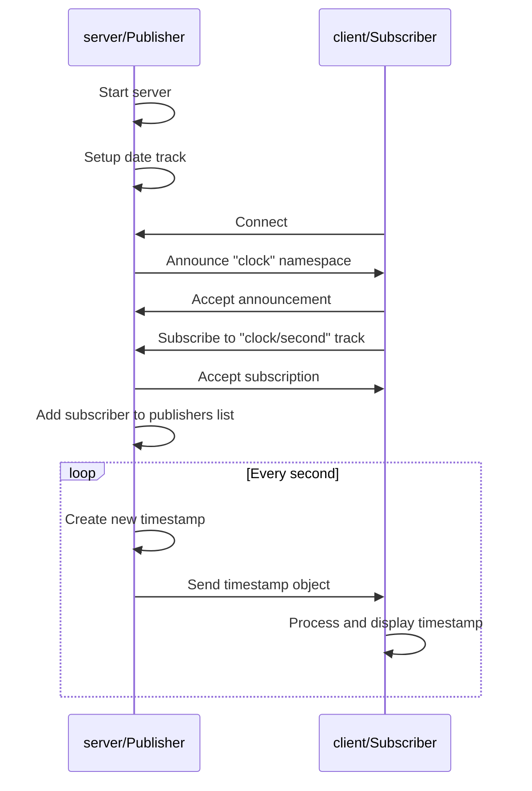

# Example: Date server and client

The `examples` directory contains an implementation of a simple client and
server which can publish and subscribe to `date` tracks using MoQ. The publisher
of a `date` track publishes timestamps every second and sends them to the
subscribers. Subscribers receive the timestamp objects.

Both the client and the server can take the roles of subscriber and publisher.
The server need certificates and key that the client trusts. There is
an automatic setup for localhost certificates and keys, unless proper
ones are provided.

Download the example:

```shell
git clone https://github.com/mengelbart/moqtransport.git
cd moqtransport/examples/date
```

To run the server and publish, run:

```shell
go run . -server -publish
```

Then, open a new shell and start a client to subscribe:

```shell
go run . -subscribe
```

Alternatively, let the server subscribe to the `date` track from the client:

```shell
go run . -server -subscribe
go run . -publish
```

(again in different shells).

The server is always prepared to connect via webtransport at the end point `/moq`.

To make a WebTransport connection from the client, run:

```shell
go run . -subscribe -webtransport -addr https://localhost:8080/moq
```

The following sequence diagram shows typical traffic between the client and the server when the server is the publisher:



